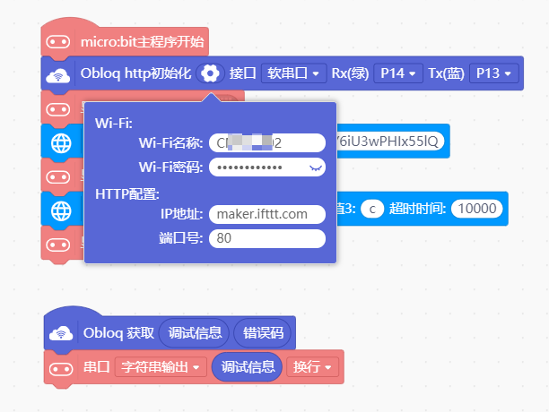

# OBLOQ IFTTT 显示屏功能增强包


---------------------------------------------------------

## 目录

* [相关链接](#相关链接)
* [描述](#描述)
* [积木列表](#积木列表)
* [示例程序](#示例程序)
* [许可证](#许可证)
* [支持列表](#支持列表)
* [更新记录](#更新记录)

## 相关链接
* 本项目加载链接: ```https://github.com/DFRobot/ext-OBLOQIFTTT```


* 用户库教程链接: ```https://mindplus.dfrobot.com.cn/extensions-user```

* 购买此产品: [商城](https://www.dfrobot.com.cn/).

## 描述
辅助OBLOQ物联网模块实现IFTTT功能，配合IFTTT网站的强大扩展功能，可以实现例如发送邮件、发送笔记等功能。
* IFTTT网站：```https://ifttt.com/```

## 积木列表


## 示例程序
* Mind+**上传模式**，**扩展**中选择自己使用的主控板，然后再**通信模块**中加载**OBLOQ物联网模块**，**用户库**中输入框输入本项目git网址即可加载。
* 先使用Obloq http初始化，输入wifi账号密码，HTTP配置中IP地址为IFTTT网址，即**maker.ifttt.com**，端口号为**80**。
* 再使用本扩展功能设置从IFTTT获取的**event及key**。
* 然后根据需要发送消息即可。



## 许可证

MIT

## 支持列表

主板型号                | 实时模式    | ArduinoC   | MicroPython    | 备注
------------------ | :----------: | :----------: | :---------: | -----
micro:bit        |             |       √       |             | 
arudino        |             |        √      |             | 


## 更新日志
* V0.0.1 功能验证完成
* V0.0.2 功能完善
